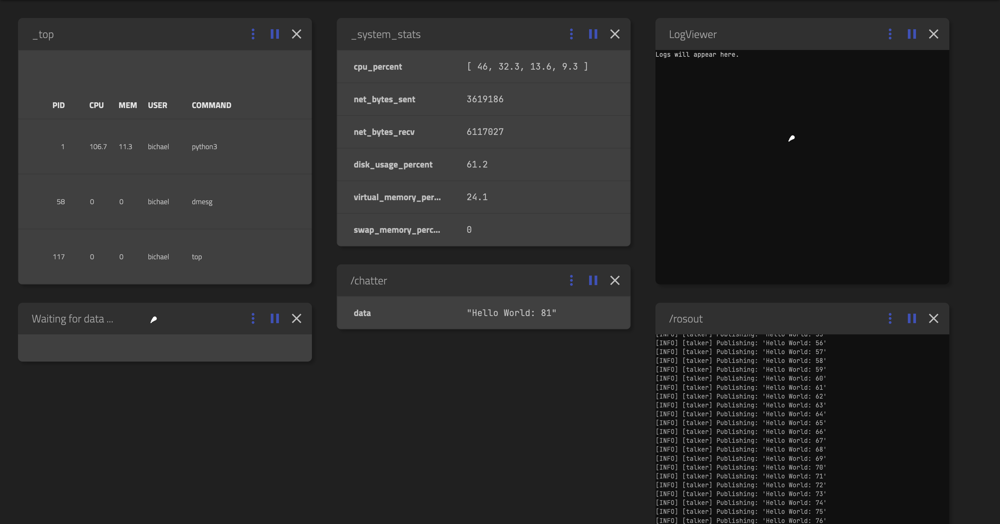
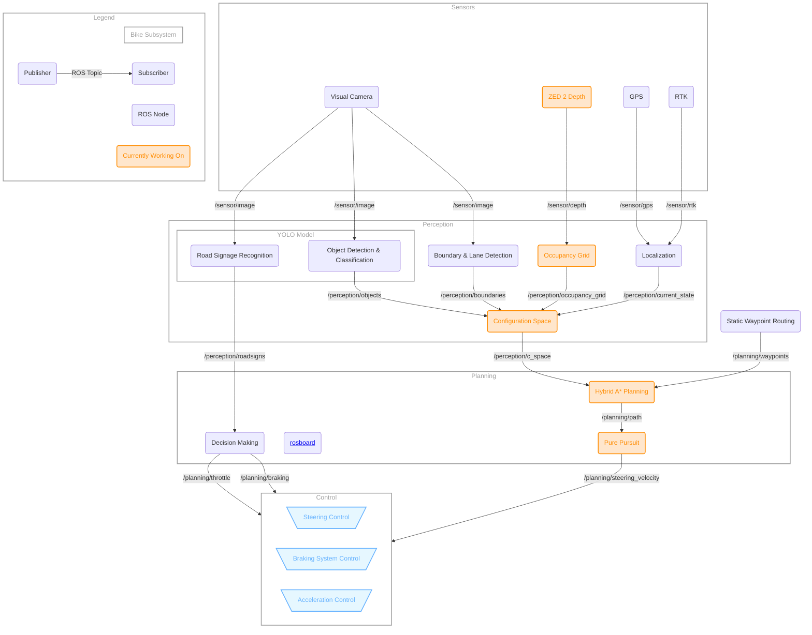

# Autobike Software

[](https://codecov.io/gh/da-luce/cornell-autobike)


- [Autobike Software](#autobike-software)
  - [Important Links](#important-links)
  - [Installation](#installation)
    - [MacOS](#macos)
    - [Linux](#linux)
    - [Windows](#windows)
    - [X Window Forwarding](#x-window-forwarding)
      - [MacOS](#macos-1)
      - [Linux](#linux-1)
      - [Windows](#windows-1)
  - [Running the Software](#running-the-software)
    - [1. Build the Image](#1-build-the-image)
    - [2. Run in a Container](#2-run-in-a-container)
    - [3. Working with ROS2](#3-working-with-ros2)
      - [Getting Started](#getting-started)
      - [Building](#building)
      - [Running a Package](#running-a-package)
      - [Visualizing with ROSBoard](#visualizing-with-rosboard)
      - [Other ROS GUIs](#other-ros-guis)
      - [Guacamole](#guacamole)
    - [4. Testing and Code Quality](#4-testing-and-code-quality)
  - [Best Practices](#best-practices)
    - [Adding Dependencies](#adding-dependencies)
    - [Directory Structure and Testing](#directory-structure-and-testing)
  - [Architecture](#architecture)
  - [Infrastructure](#infrastructure)
    - [Why Docker?](#why-docker)
    - [Why ROS?](#why-ros)
  - [Git Basics](#git-basics)
    - [Git Resources](#git-resources)
  - [Citations](#citations)

---

## Important Links

- [Software Planning Repo](https://github.com/da-luce/Autobike-Software-Planning/)
- [Vision Repo](https://github.com/da-luce/Autobike-Vision)
- [Old Navigation Repo](https://github.com/CornellAutonomousBikeTeam/Bike-Simulation-python)
- [Navigation Repo](https://github.com/da-luce/cornell-autobike)
- [Autobike Google Drive](https://drive.google.com/drive/folders/0B9FAXBSQ_mBLU25zc3h3VmR3MXc?resourcekey=0-_FN2UezNOB-4-eSO1g_xPw&usp=sharing)
- [Slack Channel](https://cuautonomousbike.slack.com/archives/C05PP2TQFCG)

---

## Installation

### MacOS

1. If not already installed, install [Homebrew](https://brew.sh/), a package
   manager for MacOS and Linux
2. Install Docker

   ```text
   brew install --cask docker
   ```

3. Open the newly installed _Docker Desktop_ application
   1. You should be able to find it in the application folder
   2. Otherwise, use Spotlight search (<kbd>⌘</kbd> + <kbd>space</kbd>) and
      search for "Docker"
4. Select "Use recommended settings"
5. Skip remaining steps if possible

### Linux

1. See [Docker install documentation](https://docs.docker.com/engine/install/)
   (ask Ari)

### Windows

1. See [Docker install documentation](https://docs.docker.com/engine/install/)
   (untested)

### X Window Forwarding

This is primarily for reference, and if you are running MacOS then you should be all set.

#### MacOS

1. Install [XQuartz](https://www.xquartz.org/) via Homebrew

    ```text
    brew install --cask xquartz
    ```

2. Logout and login of your Mac to activate XQuartz as default X11 server
3. Open XQuartz

    ```text
    open -a XQuartz
    ```

4. Go to Security Settings (Menu Bar -> XQuartz -> Settings -> Security Settings)
   and ensure that "Allow connections from network clients" is on
5. Restart your laptop (FIXME: this step may not be necessary?)
6. Allow X11 forwarding from localhost via xhost

    ```text
    xhost + localhost
    ```

  > [!IMPORTANT]
  > This must be run in the xterm window opened by default by XQuartz _every time_ XQuartz is started

7. Run a command that invokes a GUI via `docker compose`, e.g.

    ```text
    docker compose run autobike python3 src/unrosified/state_pred/bike_sim.py
    ```

    FIXME: while we are switching over to ROS, this command probably won't work :(

  > [!NOTE]
  > If you are using `docker run` (not recommended), you need to add the follow option:
  >
  > ```text
  > --env DISPLAY=host.docker.internal:0
  > ```
  >
  > This is already provided in [`docker-compose.yml`](./docker-compose.yml), so
  > there is no need to pass any flags when using `docker compose`.

#### Linux

In _theory_ this should be easier as most distros already use Xwindows,
but I know for a fact that the steps differ compared to Mac.

May have to bind this volume:

```text
--volume="$HOME/.Xauthority:/root/.Xauthority:rw"
```

May have to set

```text
--net=host
```

or

```text
--add-host=host.docker.internal:host-gateway
```

May have to bind x11 socket:

```text
--volume /tmp/.X11-unix:/tmp/.X11-unix
```

May have to set DISPLAY to

`--env DISPLAY=unix$DISPLAY` or `--env DISPLAY=$DISPLAY`

I'm not sure. Stack Overflow has a sea of possibilities.

May the odds be ever in your favor...

#### Windows

No clue.

---

## Running the Software

> [!NOTE]
> These steps assume you are in the top level of your copy of the repository. If you
> haven't already, clone the repository onto your machine:
>
> ```bash
> git clone git@github.com:da-luce/cornell-autobike.git
> ```

### 1. Build the Image

If it is your first time running the code with Docker or there have been changes made to the Dockerfile, you need to build the Docker image:

```bash
docker build -t autobike:latest .
```

Running `docker image ls` should now show this image, alongside any others you have built:

```text
REPOSITORY       TAG       IMAGE ID       CREATED         SIZE
autobike         latest    121bfa1d2778   2 minutes ago   3.67GB
```

> [!NOTE]
> Images can be deleted with `docker image rm`. Try adding the `--no-cache` flag if a rebuild isn't working as expected.

### 2. Run in a Container

To create a [container](https://docs.docker.com/guides/docker-concepts/the-basics/what-is-a-container/) and run code, you can use one of the following techniques:

- Interactive shell: `docker compose run --rm autobike`
- One off command: `docker compose run --rm autobike <your command>`

[`docker compose`](./docker-compose.yml) specifies all the command line args you would normally run using plain `docker run`. The following notes are present if for some reason you are only using `docker run` and for explanation of the information in [`./docker-compose.yml`](./docker-compose.yml).

> [!NOTE]
> When no tag is selected, Docker uses the `latest` tag by [defualt](https://docs.docker.com/reference/cli/docker/image/tag/).

> [!NOTE]
> The [volume](https://docs.docker.com/engine/storage/volumes/) is mounted such that changes to your local code are immediately reflected in the container.

> [!WARNING]
> If the volume is not specified in the command line arguments, the container will run
> with the code that was present when the image was _built_ (this could be quite a while
> ago).

Example of a one off command:

```bash
docker compose run --rm autobike ros2 run demo_nodes_cpp talker
```

> [!NOTE]
> Spinning up a new container isn't free--it can take a few moments. As such, an interactive shell is often the preferred method of development.

> [!TIP]
> Create an alias in your `.bashrc` (or whatever shell you are using) to avoid getting carpal tunnel
>
> ```bash
> alias autobike="docker compose run --rm autobike"
> ```
>
> A quick way to do this if you are using Bash:
>
> ```bash
> echo <above_command> >> ~/.bashrc
> ```
>
> Or Zsh (default on MacOS):
>
> ```bash
> echo <above_command> >> ~/.zshrc
> ```

### 3. Working with ROS2

#### Getting Started

- [What is ROS2?](https://github.com/ros2)
- [Why are we using ROS?](#why-ros)
- [ROS2 Docs](https://docs.ros.org/en/humble/Installation.html)

ROS2 utilizes packages and nodes to organize and manage modular components in a robotic system. Most importantly, it is widely supported and offers built-in compatibility with the sensors we use. We define our ROS packages in `./src`. See this [tutorial](https://docs.ros.org/en/humble/Tutorials/Beginner-Client-Libraries/Writing-A-Simple-Py-Publisher-And-Subscriber.html) on how to write your first package. The [waypoints](./src/waypoints/) package should serve as a good example of how to build a simple package.

#### Building

ROS2 uses [colcon](https://colcon.readthedocs.io/en/released/) to build, test, and manage workspaces.
It can automatically detect package types (e.g., CMake, Python, etc.) and build them accordingly.

To build the project, run `build` in a container. You should see `colcon` build the packages:

```text
Starting >>> waypoints
Finished <<< waypoints [0.59s]

Summary: 1 package finished [0.88s]
```

> [!NOTE]
> `build` is essentially an alias for `colcon build && source install/setup.bash`.
>
> WARNING: If not using the alias, this should all be done in the **top level directory**, or else you will have build artifacts all over the place. The alias forces the correct directory.

> [!TIP]
> If you encounter strange behavior, it’s often a good idea to clean your workspace before rebuilding: `rm -rf build/ install/ log/`. There is an alias `clean` to make this easier.

#### Running a Package

Packages may define an entry point to be run independently. For example: `ros2 run waypoints waypoints` runs the waypoint node. You should see the node generating waypoints:

```text
[INFO] [1723919908.828374763] [waypoints_node]: Waypoint routing node started
[INFO] [1723919909.943448889] [waypoints_node]: Published path with 119 waypoints
```

> [!IMPORTANT]
> Every time a package changes, you need to [rebuild](#building) it to see the changes (even python code!)

#### Visualizing with ROSBoard

1. Start both services in the background on the same network: `docker compose up -d`. The dev container will exit, this is alright. You should see something like:

    ```text
    [+] Running 3/3
    ✔ Network cornell-autobike_rosnet  Created         0.0s
    ✔ Container autobike_dev           Started         0.2s
    ✔ Container rosboard               Started         0.4s
    ```

2. Attach to the dev container: `docker compose exec autobike bash`
3. Run a demo: `ros2 run demo_nodes_cpp talker`. You should see something like this being logged in your terminal:

    ```text
    [INFO] [1723831327.616574043] [talker]: Publishing: 'Hello World: 1'
    [INFO] [1723831328.618190002] [talker]: Publishing: 'Hello World: 2'
    [INFO] [1723831329.618042586] [talker]: Publishing: 'Hello World: 3'
    ```

4. Go to [`localhost:8888`](http://localhost:8888/), and you should see the `/chatter` topic being logged in the dashboard!



5. Run `docker compose down` when you are done.

> [!NOTE]
> If you are struggling to get this working, try deleting all your containers and restarting at [step 1](#visualizing-with-rosboard).

#### Other ROS GUIs

Certain ROS tools like `rqt` and `rqt_graph` can work quite well using [X11 forwarding](#x-window-forwarding), even on macOS with Apple Silicon. However, more complex 3D visualization tools like `RViz2` and simulation environments like `Gazebo` seem to struggle with X forwarding on macOS, especially on Apple Silicon (issues from XQuartz to Docker to everything between), or don't work outright.

On the NVIDIA Jetson, tools like RViz and Gazebo should work smoothly without these limitations using X11 forwarding.

For Apple Silicon, using a VNC server inside the container is an alternative solution, but performance has been lackluster in practice due to latency and rendering issues.

A potential solution for visualizing built-in ROS message types in these environments is to use ROSboard. ROSboard renders ROS data types using WebGL directly in a web browser, bypassing the need for complex GUI forwarding or VNC setups. This approach works cross-platform, offering a lightweight and responsive alternative for visualizing ROS topics. More work is needed if we are rending custom data types though.

#### Guacamole

1. Start docker demon
2. `docker compose up -d`
3. Open a root shell to dev container and run: `service xrdp start`
  Can use: `docker exec -it --user root  autobike_dev bash`
4. Go to `http://localhost:8080/guacamole`
  i. Username: `user`
  ii. Password: `password`
5. Login to the desktop GUI
  i. Username: `bichael`
  ii. Password: `autobike`

### 4. Testing and Code Quality

We use [black](https://github.com/psf/black) for formatting, [pylint](https://pypi.org/project/pylint/) for linting, and [mypy](https://mypy.readthedocs.io/en/stable/) for type checking. If you are using [VS Code](https://code.visualstudio.com/), the provided [VS Code settings](.vscode/settings.json) should automatically setup everything you need. Just make sure you have the [recommended extensions](./.vscode/extensions.json) installed.

For other IDEs, there may be extensions provided for these tools, or you could just use the CLI equivalents. Make sure to pass the `pyproject.toml` file as an arg (e.g. `--rcfile=pyproject.toml` or `--config=pyproject.toml`) to use the same formatting and linting settings as the rest of the project. For your convenience, there are aliases defined in `.bashrc` within the container (these are sourced from [`shell_env.sh`](./shell_env.sh)).

| Procedure               | Tool                                                           | Command                                        | Alias          |
| ----------------------- | -------------------------------------------------------------- | ---------------------------------------------- | -------------- |
| **Linting**             | [pylint](https://pypi.org/project/pylint/)                     | `pylint --rcfile=pyproject.toml src/`          | `lint`         |
| **Testing** (Method 1)  | [pytest](https://docs.pytest.org/en/stable/)                   | `pytest`                                       | `pytest`       |
| **Testing** (Method 2)* | [colcon](https://colcon.readthedocs.io/en/released/) + pytest  | `colcon test --event-handlers console_direct+` | `coltest`      |
| **Formatting**          | [black](https://pypi.org/project/black/)                       | `black --config pyproject.toml .`              | `format`       |
| **Formatting**          | [black](https://pypi.org/project/black/)                       | `black --config pyproject.toml --check .`      | `format_check` |
| **Type checking**       | [mypy](https://mypy-lang.org/)                                 | `mypy --config-file=pyproject.toml src/`       | `type_check`   |
| Building                | [colcon]([colcon](https://colcon.readthedocs.io/en/released/)) | `colcon build`                                 | `build`        |

*_colcon will automatically collect package pytest tests and run them. It is difficult to get both of these to work at the same time. You should ensure that `pytest` always works as this is what we use to validate PRs. Colcon does not support code coverage with the same ease that pytest does._

> [!IMPORTANT]
> You need to `build` before running pytest!

> [!NOTE]
> Docker runs the container in a non-interactive shell, which by default does not load
> `.bashrc` unless explicitly told to when running a "one off command." So if you are
> within the container, running `lint` will lint just fine. However, to run it as a one off,
> you need to use the `-i` flag with bash: `docker compose run --rm autobike bash -ic "lint"`

---

## Best Practices

### Adding Dependencies

When adding dependencies (pip, apt, etc.) in [pyproject.toml](./pyproject.toml) or [Dockerfile](./Dockerfile), always pin a specific version.

### Directory Structure and Testing

```text
src/
├─ package_a/
├─ package_b/
│  ├─ resource/
│  │  ├─ package_b
│  ├─ test/
│  │  ├─ test_package_b_node.py
│  ├─ package_b/
│  │  ├─ package_b_node.py
│  │  ├─ __init__.py
│  ├─ README.md
│  ├─ setup.py
│  ├─ package.xml
```

- Nodes should prioritize using standardized [ROS 2 common data types](https://github.com/ros2/common_interfaces). These types are widely supported across the ROS ecosystem, ensuring better compatibility and integration with other ROS packages and sensors.
- The [waypoints](./src/waypoints/) package should serve as a good example of how to build a simple package.
- Each package should contain a `README.md` which contains basic documentation on how one should use the file along wih other relevant info:
  - Exported constants and functions
  - Implementation documentation as seen fit
  - **Citations** and **sources**
  - Perhaps, add a small [Mermaid](https://mermaid.live) diagram
- Each package should have a corresponding `test/test_package_X.py` file containing `pytest` tests

---

## Architecture



- **Sensors Layer**: Responsible for collecting raw data from various sensors, including LiDAR, cameras, GPS, and RTK. These sensors provide crucial information about the environment, such as obstacles, road markings, and the bicycle’s location. This data is the foundation for perception, localization, and decision-making processes.

- **Static Route Mapping Layer**: Uses offline OpenStreetMap (OSM) data to generate a static route with predefined waypoints. This static route is used as the baseline path that the dynamic path planning will refine based on real-time conditions.

- **Perception Layer**: The perception layer processes raw sensor data to create a detailed understanding of the surrounding environment. It includes subsystems for detecting objects, recognizing road signs, identifying lane boundaries, and generating an occupancy grid. This data is combined into a 2D, discretized configuration space (C-space), which represents "the actual free space zone for the movement of robot and guarantees that the vehicle or robot must not collide with the obstacle" [^1]. The C-space first accounts for boundaries, such as lane lines or the edge of the road. The goal is to "hug" the right-most boundary relatively closely, by closing off anything past the right-most boundary and penalizing movement away from it. Hence, the C-space effectively represents our "bike lane." The occupancy grid accounts for unexpected objects in our "bike lane," expanding obstacles in the environment to include a safety margin that accounts for the bounding box of the bike. Not sure how we incorporate YOLO.

- **Localization Layer**: Estimates the current state of the bicycle, including its position and orientation, using data from GPS and real time kinematics (RTK). The Kalman filter refines these estimates, while the kinematic model predicts future states.

- **Planning and Decision-Making Layer**: Plans the optimal path to the next waypoint [^2]. The path planning subsystem refines the route through the configuration space--we aim to use a Hybrid A* algorithm [^3]. The behavioral planning module handles high-level decisions, such as stopping at red lights or and obeying road rules (this is not as important as path planning). Given the path, we can easily deduce how we need to adjust our steering/speed to achieve the next point.

- **Control Layer**: This is not our responsibility

---

## Infrastructure

### Why Docker?

- Code is always reproducible and consistent across all environments
- Docker encapsulates everything we need, including system-level dependencies, apt packages, and other tools, not just Python libraries like virtual environments do
- Installing ROS any other way is beyond painful

### Why ROS?

- ROS (Robot Operating System) is widely used across the robotics industry, providing a reliable and well-supported framework
- ROS provides built-in tools and frameworks for asynchronous communication (e.g., publishers, subscribers, services, and actions), so we don't need to implement these from scratch
- ROS includes powerful tools for visualizing data (e.g., RViz) and monitoring system performance, aiding in development and debugging
- Yes, ROS [sucks](https://news.ycombinator.com/item?id=24280204#24301628) in [numerous ways](https://answers.ros.org/question/316916/why-did-ros-prevail/), but ultimately we would be shooting ourselves in the foot by not using it. If it's good enough for [NASA](https://science.nasa.gov/mission/viper/lunar-operations), we can make it work for our use case.

## Git Basics

- **Clone the Repository:**
  - To start working on the project, clone the repository to your local machine:

    ```bash
    git clone git@github.com:da-luce/cornell-autobike.git
    ```

- **Navigate to the Repository:**
  - Change your current directory to the project directory:

    ```bash
    cd cornell-autobike
    ```

- **Create a New Branch:**
  - Before making changes, create a new branch off of `main`:

    ```bash
    git checkout -b <feature-name> main
    ```

    - Replace `<feature-name>` with a descriptive name for your feature (without the `<>`).
    - Example: `git checkout -b add-user-auth main`

- **Make Changes and Commit:**
  - Work on your feature or changes. When ready, stage and commit your changes:

    ```bash
    git add .
    git commit -m "Descriptive message about what you changed"
    ```

- **Push Your Branch to GitHub:**
  - After committing your changes, push your branch to GitHub:

    ```bash
    git push origin <feature-name>
    ```

- **Create a Pull Request:**
  - Go to the repository on GitHub and navigate to the [Pull Requests page](https://github.com/da-luce/cornell-autobike/pulls).
  - Create a pull request to merge your branch into the `dev` branch.

### Git Resources

- [Git Basics Documentation](https://git-scm.com/doc)
- [Pro Git Book](https://git-scm.com/book/en/v2)
- [GitHub Guides](https://guides.github.com/)

---

## Citations

[^1]: [Debnath, Sanjoy & Omar, Rosli & Abdul Latip, Nor Badariyah. (2019). A Review on Energy Efficient Path Planning Algorithms for Unmanned Air Vehicles: 5th ICCST 2018, Kota Kinabalu, Malaysia, 29-30 August 2018. 10.1007/978-981-13-2622-6_51.](https://www.researchgate.net/publication/327271383_A_Review_on_Energy_Efficient_Path_Planning_Algorithms_for_Unmanned_Air_Vehicles_5th_ICCST_2018_Kota_Kinabalu_Malaysia_29-30_August_2018)

[^2]: [Mohamed Reda, Ahmed Onsy, Amira Y. Haikal, Ali Ghanbari, Path planning algorithms in the autonomous driving system: A comprehensive review, Robotics and Autonomous Systems, Volume 174, 2024, 104630, ISSN 0921-8890, https://doi.org/10.1016/j.robot.2024.104630.](https://www.sciencedirect.com/science/article/pii/S0921889024000137)

[^3]: [https://medium.com/@junbs95/gentle-introduction-to-hybrid-a-star-9ce93c0d7869](https://medium.com/@junbs95/gentle-introduction-to-hybrid-a-star-9ce93c0d7869)
