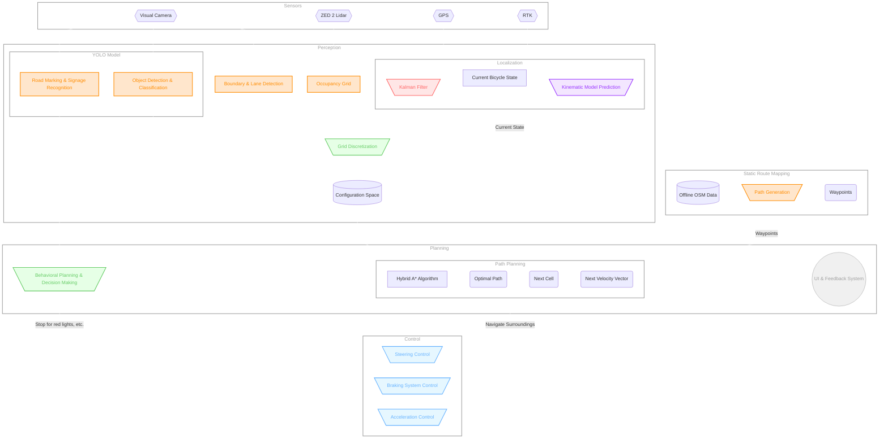

# Autobike Software

[](https://codecov.io/gh/da-luce/cornell-autobike)


- [Autobike Software](#autobike-software)
  - [Git Basics](#git-basics)
    - [Git Resources](#git-resources)
  - [Running Code with Docker](#running-code-with-docker)
    - [Installation](#installation)
      - [MacOS](#macos)
      - [Linux](#linux)
      - [Windows](#windows)
    - [Building an Image](#building-an-image)
    - [Running in a Container](#running-in-a-container)
    - [X Window Forwarding](#x-window-forwarding)
      - [MacOS](#macos-1)
      - [Linux](#linux-1)
      - [Windows](#windows-1)
    - [Testing](#testing)
  - [Best Practices](#best-practices)
    - [Adding Dependencies](#adding-dependencies)
    - [Formatting and Linting](#formatting-and-linting)
    - [Directory Structure and Testing](#directory-structure-and-testing)
  - [Architecture](#architecture)
  - [Citations](#citations)

## Git Basics

- **Clone the Repository:**
  - To start working on the project, clone the repository to your local machine:

    ```bash
    git clone git@github.com:da-luce/cornell-autobike.git
    ```

- **Navigate to the Repository:**
  - Change your current directory to the project directory:

    ```bash
    cd cornell-autobike
    ```

- **Create a New Branch:**
  - Before making changes, create a new branch off of `main`:

    ```bash
    git checkout -b <feature-name> main
    ```

    - Replace `<feature-name>` with a descriptive name for your feature (without the `<>`).
    - Example: `git checkout -b add-user-auth main`

- **Make Changes and Commit:**
  - Work on your feature or changes. When ready, stage and commit your changes:

    ```bash
    git add .
    git commit -m "Descriptive message about what you changed"
    ```

- **Push Your Branch to GitHub:**
  - After committing your changes, push your branch to GitHub:

    ```bash
    git push origin <feature-name>
    ```

- **Create a Pull Request:**
  - Go to the repository on GitHub and navigate to the [Pull Requests page](https://github.com/da-luce/cornell-autobike/pulls).
  - Create a pull request to merge your branch into the `dev` branch.

### Git Resources

- [Git Basics Documentation](https://git-scm.com/doc)
- [Pro Git Book](https://git-scm.com/book/en/v2)
- [GitHub Guides](https://guides.github.com/)

## Running Code with Docker

### Installation

#### MacOS

1. If not already installed, install [Homebrew](https://brew.sh/), a package
   manager for MacOS and Linux
2. Install Docker

   ```text
   brew install --cask docker
   ```

3. Open the newly installed _Docker Desktop_ application
   1. You should be able to find it in the application folder
   2. Otherwise, use Spotlight search (<kbd>⌘</kbd> + <kbd>space</kbd>) and
      search for "Docker"
4. Select "Use recommended settings"
5. Skip remaining steps if possible

#### Linux

1. See [Docker install documentation](https://docs.docker.com/engine/install/)
   (ask Ari)

#### Windows

1. See [Docker install documentation](https://docs.docker.com/engine/install/)
   (untested)

### Building an Image

If it is your first time running the code with Docker or there have been changes made to the Dockerfile, you need to build the Docker image:

```bash
docker build -t autobike:latest .
```

Running `docker image ls` should now show this image, alongside any others you have built:

```text
REPOSITORY       TAG       IMAGE ID       CREATED         SIZE
autobike         latest    121bfa1d2778   2 minutes ago   3.67GB
```

> [!NOTE]
> Images can be deleted with `docker image rm`

### Running in a Container

To create a [container](https://docs.docker.com/guides/docker-concepts/the-basics/what-is-a-container/) and run code, you can use one of the following techniques:

- Interactive shell: `docker run -it --rm -v "$(pwd):/usr/app" --user root autobike`
- One off command: `docker run -it --rm -v "$(pwd):/usr/app" --user root autobike <your command>`

> [!NOTE]
> When no tag is selected, Docker uses the `latest` tag by [defualt](https://docs.docker.com/reference/cli/docker/image/tag/).

> [!NOTE]
> The [volume](https://docs.docker.com/engine/storage/volumes/) is mounted such that changes to your local code are immediately reflected in the container.

> [!WARNING]
> If the volume is not specified in the command line arguments, the container will run
> with the code that was present when the image was _built_ (this could be quite a while
> ago).

Example of a one off command:

```bash
docker run -it --rm -v "$(pwd):/usr/app" --user root autobike python src/qlearning/main.py
```

> [!NOTE]
> Spinning up a new container isn't free--it can take a few moments. As such, an interactive shell is often the preferred method of development.

> [!TIP]
> Create an alias in your `.bashrc` (or whatever shell you are using) to avoid getting carpal tunnel
>
> ```bash
> alias autobike="docker run -it --rm -v '$(pwd):/usr/app' --user root autobike"
> ```
>
> A quick way to do this if you are using Bash:
>
> ```bash
> echo <above_command> >> ~/.bashrc
> ```
>
> Or Zsh (default on MacOS):
>
> ```bash
> echo <above_command> >> ~/.zshrc
> ```

### X Window Forwarding

#### MacOS

1. Install [XQuartz](https://www.xquartz.org/) via Homebrew

    ```text
    brew install --cask xquartz
    ```

2. Logout and login of your Mac to activate XQuartz as default X11 server
3. Open XQuartz

    ```text
    open -a XQuartz
    ```

4. Go to Security Settings (Menu Bar -> XQuartz -> Settings -> Security Settings)
   and ensure that "Allow connections from network clients" is on
5. Restart your laptop (FIXME: this step may not be necessary?)
6. Allow X11 forwarding from localhost via xhost

    ```text
    xhost + localhost
    ```

> [!IMPORTANT]
> This must be run in the xterm window opened by default by XQuartz _every time_ XQuartz is started

7. Add the following option whenever you run `docker run`:

    ```text
    --env DISPLAY=host.docker.internal:0
    ```

    Example:

    ```text
    docker run -it --rm -v "$(pwd):/usr/app" --user root --env DISPLAY=host.docker.internal:0 autobike python src/state_pred/bike_sim.py
    ```

#### Linux

In _theory_ this should be easier as most distros already use Xwindows,
but I know for a fact that the steps differ compared to Mac.

May have to bind this volume:

```text
--volume="$HOME/.Xauthority:/root/.Xauthority:rw"
```

May have to set

```text
--net=host
```

or

```text
--add-host=host.docker.internal:host-gateway
```

May have to bind x11 socket:

```text
--volume /tmp/.X11-unix:/tmp/.X11-unix
```

May have to set DISPLAY to

`--env DISPLAY=unix$DISPLAY` or `--env DISPLAY=$DISPLAY`

I'm not sure. Stack Overflow has a sea of possibilities.

May the odds be ever in your favor...

#### Windows

No clue.

### Testing

1. Follow the above guide for running code in Docker containers
2. Run `pytest` within a container in the top level dir of the repo

> [!NOTE]
> This is `/usr/app/` given how our volume is mounted

## Best Practices

### Adding Dependencies

When adding dependencies (pip, apt, etc.) in [pyproject.toml](./pyproject.toml) or [Dockerfile](./Dockerfile), always pin a specific version.

### Formatting and Linting

We use [black](https://github.com/psf/black) for formatting, [pylint](https://pypi.org/project/pylint/) for linting, and [mypy](https://mypy.readthedocs.io/en/stable/) for type checking. If you are using [VS Code](https://code.visualstudio.com/), the provided [VS Code settings](.vscode/settings.json) should automatically setup everything you need. Just make sure you have the [recommended extensions](./.vscode/extensions.json) installed.

For other IDEs, there may be extensions provided for these tools, or you could just use the CLI equivalents. Make sure to pass the `pyproject.toml` file as an arg (e.g. `--rcfile=pyproject.toml` or `--config=pyproject.toml`) to use the same formatting and linting settings as the rest of the project. Examples (run from the top level of the repo):

- **Linting:** `pylint --rcfile=pyproject.toml src/`
- **Test:** `pytest`
- **Formatting:** `black --config pyproject.toml .`
- **Type checking:** `mypy --config-file=pyproject.toml src/`

### Directory Structure and Testing

```text
.
├── src/
│   ├── moduleA
│   ├── moduleB/
│   │   ├── __init__.py
│   │   ├── foo.py
│   │   └── README.md
│   └── main.py
└── test/
    ├── test_moduleA.py
    └── test_moduleB.py
```

- Each module should contain an `__init__.py` file along with a `README.md` which
  contains basic documentation on how one should use the file along wih other relevant info:
  - Exported constants and functions
  - Implementation documentation as seen fit
  - **Citations** and **sources**
- Each module should have a corresponding `test_moduleX.py` file containing `pytest` tests
  - Perhaps, add a small [Mermaid](https://mermaid.live) diagram

## Architecture



- **Sensors Layer**: Responsible for collecting raw data from various sensors, including LiDAR, cameras, GPS, and RTK. These sensors provide crucial information about the environment, such as obstacles, road markings, and the bicycle’s location. This data is the foundation for perception, localization, and decision-making processes.

- **Static Route Mapping Layer**: Uses offline OpenStreetMap (OSM) data to generate a static route with predefined waypoints. This static route is used as the baseline path that the dynamic path planning will refine based on real-time conditions.

- **Perception Layer**: The perception layer processes raw sensor data to create a detailed understanding of the surrounding environment. It includes subsystems for detecting objects, recognizing road signs, identifying lane boundaries, and generating an occupancy grid. This data is combined into a 2D, discretized configuration space (C-space), which represents "the actual free space zone for the movement of robot and guarantees that the vehicle or robot must not collide with the obstacle" [^1]. The C-space first accounts for boundaries, such as lane lines or the edge of the road. The goal is to "hug" the right-most boundary relatively closely, by closing off anything past the right-most boundary and penalizing movement away from it. Hence, the C-space effectively represents our "bike lane." The occupancy grid accounts for unexpected objects in our "bike lane," expanding obstacles in the environment to include a safety margin that accounts for the bounding box of the bike. Not sure how we incorporate YOLO.

- **Localization Layer**: Estimates the current state of the bicycle, including its position and orientation, using data from GPS and real time kinematics (RTK). The Kalman filter refines these estimates, while the kinematic model predicts future states.

- **Planning and Decision-Making Layer**: Plans the optimal path to the next waypoint [^2]. The path planning subsystem refines the route through the configuration space--we aim to use a Hybrid A* algorithm [^3]. The behavioral planning module handles high-level decisions, such as stopping at red lights or and obeying road rules (this is not as important as path planning). Given the path, we can easily deduce how we need to adjust our steering/speed to achieve the next point.

- **Control Layer**: This is not our responsibility

## Citations

[^1]: [Debnath, Sanjoy & Omar, Rosli & Abdul Latip, Nor Badariyah. (2019). A Review on Energy Efficient Path Planning Algorithms for Unmanned Air Vehicles: 5th ICCST 2018, Kota Kinabalu, Malaysia, 29-30 August 2018. 10.1007/978-981-13-2622-6_51.](https://www.researchgate.net/publication/327271383_A_Review_on_Energy_Efficient_Path_Planning_Algorithms_for_Unmanned_Air_Vehicles_5th_ICCST_2018_Kota_Kinabalu_Malaysia_29-30_August_2018)

[^2]: [Mohamed Reda, Ahmed Onsy, Amira Y. Haikal, Ali Ghanbari, Path planning algorithms in the autonomous driving system: A comprehensive review, Robotics and Autonomous Systems, Volume 174, 2024, 104630, ISSN 0921-8890, https://doi.org/10.1016/j.robot.2024.104630.](https://www.sciencedirect.com/science/article/pii/S0921889024000137)

[^3]: [https://medium.com/@junbs95/gentle-introduction-to-hybrid-a-star-9ce93c0d7869](https://medium.com/@junbs95/gentle-introduction-to-hybrid-a-star-9ce93c0d7869)
